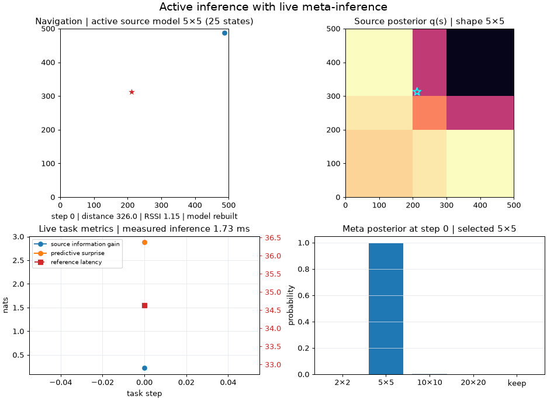

# Active Inference with Meta-Inference

[](https://github.com/Diluna98/active-inference-with-meta-inference/actions/workflows/ci.yml)
[](LICENSE)

A hierarchical active-inference implementation for adaptive computational
model selection. A task-level agent performs continuous-observation RSSI
navigation, while a meta-level agent selects the spatial resolution of the
task agent's source-location representation.



The animation runs the simulated continuous RSSI task from
[Active-Inference Navigation Agent](https://github.com/Diluna98/active-inference-navigation-agent)
with the algorithmic configuration used for the paper experiments.
The task agent begins with a `2×2` source representation. Meta-inference
selects among `2×2`, `5×5`, `10×10`, and `20×20` representations from
task-level evidence and computational measurements. Every accepted switch
rebuilds the PyAIF navigation model, changes the source-state dimension, and
remaps the full deep temporal source belief into the new grid. Navigation
therefore continues without resetting the accumulated source belief.

The implementation uses
[PyAIF](https://github.com/Diluna98/python_active_inference) for state and
policy inference.

## Architecture

```text
continuous task observations [x, y, RSSI]
      │
      ▼
task-level active-inference agent
      │
      ├── RSSI Fisher-information proxy
      ├── policy-averaged RSSI surprise
      ├── state-inference latency
      └── baseline-ratio compute availability
                │
                ▼
      meta-inference agent
                │
                ▼
  select 2×2, 5×5, 10×10, 20×20,
          or keep the current model
```

The meta-generative model contains three hidden-state factors:

```text
representation ∈ {2×2, 5×5, 10×10, 20×20}
task context   ∈ {context 0, context 1, context 2, context 3}
compute state  ∈ {low, medium, high}
```

Its four continuous observation modalities are:

```text
[RSSI information proxy, predictive surprise, latency in ms, compute availability]
```

Actions `0–3` select one of the four representations. Action `4` keeps the
current representation. Policy inference evaluates the expected free energy of
these alternatives using likelihoods over task context, representation,
latency, and compute state.

## Installation

```bash
git clone https://github.com/Diluna98/active-inference-with-meta-inference.git
cd active-inference-with-meta-inference
python -m venv .venv
python -m pip install -e .
```

Install development tools with:

```bash
python -m pip install -e ".[dev]"
```

## Run the example

Run meta-inference over the packaged task trace:

```bash
active-inference-meta
```

Save the complete posterior, expected-free-energy, risk, and ambiguity traces:

```bash
active-inference-meta --output meta_decisions.json
```

Use a custom JSON observation trace:

```bash
active-inference-meta \
  --trace observations.json \
  --initial-resolution 5
```

Each trace record has this structure:

```json
{
  "information_gain_proxy": 0.05,
  "prediction_error": 2.4,
  "inference_latency_ms": 80.0,
  "cpu_availability": 87.5
}
```

These field names are retained for API compatibility. In this implementation,
`information_gain_proxy` is the RSSI Fisher-information proxy,
`prediction_error` is policy-averaged predictive surprise, and
`cpu_availability` is the baseline-ratio compute-availability proxy.

## Run the adaptive RSSI simulation

Run the integrated task/meta-agent simulation:

```bash
active-inference-meta-navigation
```

Recreate the README animation:

```bash
active-inference-meta-navigation-gif
```

## Paper-compatible configuration

The integrated simulation reproduces the paper's algorithmic setup:

- Three-step deep temporal task inference with 10 message-passing iterations
- 25 cardinal movement policies and 500 policy samples
- The master-grid RSSI Fisher-information proxy
- The unweighted, policy-averaged binned RSSI surprise
- Raw wall-clock latency measured around task state inference only
- Compute availability derived from the paper's resolution-specific latency baselines
- Meta-inference every three task updates
- Online learning of the meta-level prediction-error and latency parameters

The RSSI information proxy is the likelihood-weighted spatial Fisher
sensitivity of the fixed `20×20` reference signal model. Predictive surprise is
the mean negative log probability of the observed RSSI bin across task
policies; it is not weighted by the task policy posterior.

There is no artificial latency multiplier. The compute-availability
observation is:

```text
clip(100 × baseline_latency[resolution] / measured_latency, 0, 100)
```

This is a baseline-ratio proxy, not a direct operating-system CPU-utilization
measurement. Absolute latency and therefore the inferred compute state depend
on the processor, operating-system load, Python runtime, and PyAIF version.
Reproducing the algorithm does not imply bit-for-bit identical trajectories or
wall-clock measurements.

If meta-inference selects a different representation, that task action is not
executed. The model is rebuilt first, all policy- and time-dependent source
beliefs and policy predictions are preserved, and task inference resumes on
the next update.

## Adapting the pipeline to real sensors

The paper-compatible simulation supplies task observations in the form
`[x, y, RSSI]` and uses a continuous Gaussian likelihood for those
observations. In a real deployment, these values will come from the robot's
localization system and radio receiver.

If the real system retains the same observation semantics, the task likelihood
should be calibrated using real sensor data: coordinate uncertainty, RSSI
noise, signal decay, workspace geometry, and receiver-dependent scaling. If
the observation modalities change, the likelihood dependencies and the
task-level information and surprise calculations must change with them.

The remainder of the hierarchy can retain the paper procedure:

- Deep temporal task inference and policy evaluation
- Task-metric extraction from the calibrated likelihood model
- The four-observation meta-generative model
- The three-step meta-inference schedule
- Belief-preserving representation switching

The target computer also requires new latency baselines and, preferably,
retraining or online adaptation of the meta-level latency likelihood. The
paper baselines describe the experimental platform; they are retained here for
paper-compatible simulation, not presented as universal hardware constants.

## Python API

```python
from active_inference_meta import (
    MetaInferenceController,
    MetaObservation,
)

controller = MetaInferenceController()
decision = controller.infer(
    current_resolution=2,
    observation=MetaObservation(
        information_gain_proxy=0.05,
        prediction_error=2.4,
        inference_latency_ms=80.0,
        cpu_availability=87.5,
    ),
)

print(decision.selected_resolution)
print(decision.policy_posterior)
print(decision.expected_free_energy)
```

For sequential operation, call `infer()` repeatedly or use
`infer_sequence()`. The controller performs online updates of its learned
prediction-error and latency likelihood parameters.

The integrated navigation loop is also available as a Python API:

```python
from active_inference_meta import (
    AdaptiveNavigationConfig,
    run_adaptive_navigation_episode,
)

result = run_adaptive_navigation_episode(
    config=AdaptiveNavigationConfig(maximum_steps=18)
)

print(result.resolutions)
print(result.switch_steps)
```

## Learned meta-likelihood

The packaged parameters define:

- A Gaussian likelihood for the RSSI Fisher-information proxy conditioned on context
- A Student-t likelihood for predictive surprise conditioned on representation and context
- A Gaussian latency likelihood conditioned on representation and compute state
- A Gaussian compute-availability likelihood conditioned on compute state

The learned parameter tables are stored in
`src/active_inference_meta/data/meta_likelihood_parameters.json`.

## Development

```bash
ruff check .
pytest -q
python -m build
```

GitHub Actions runs linting, tests, and package builds on Python 3.10 and 3.11.

## License

This project is available under the [MIT License](LICENSE).

Copyright © 2026 Diluna A. Warnakulasuriya.
